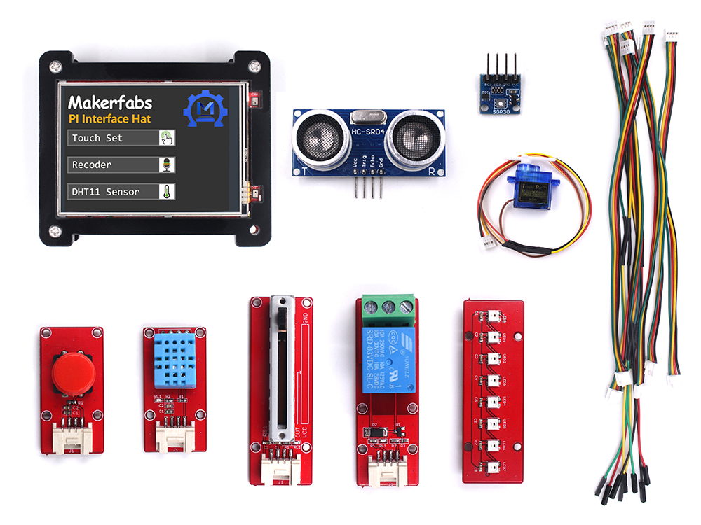
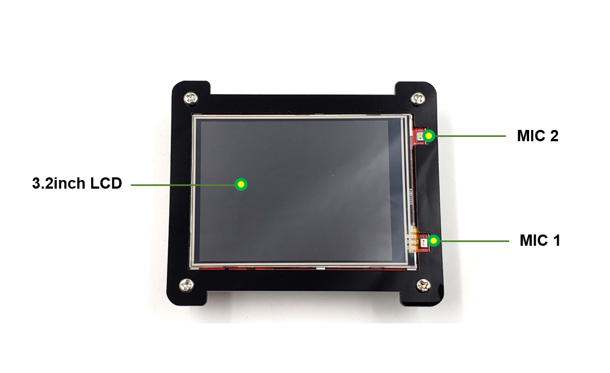
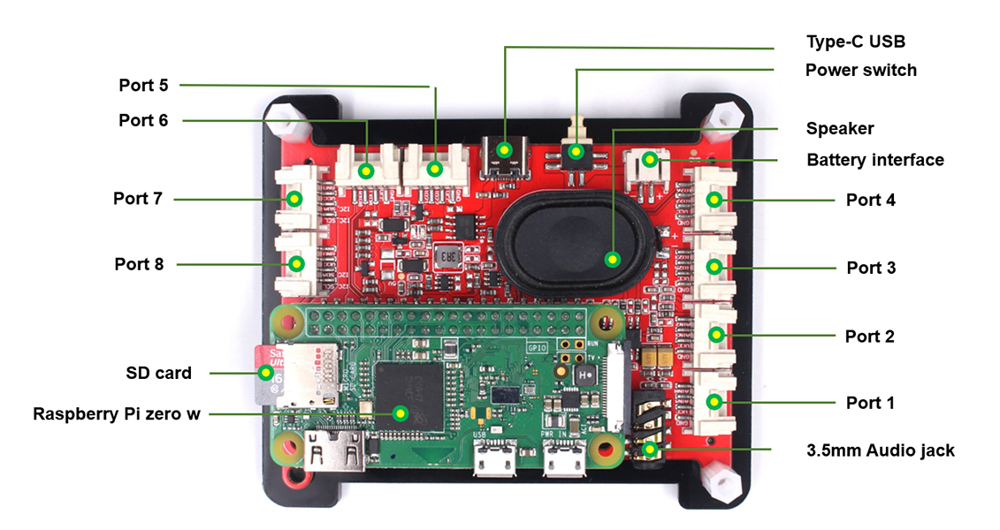
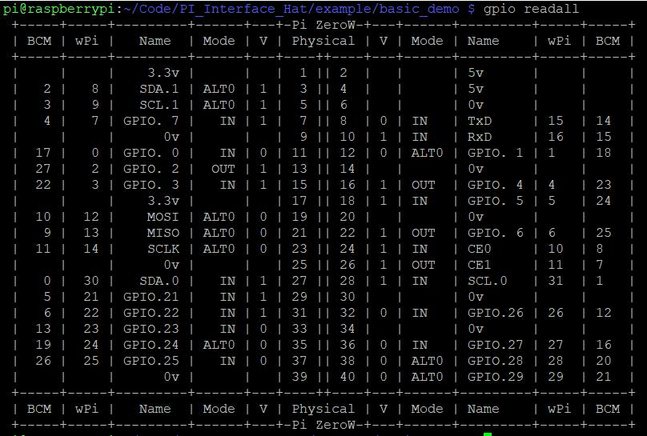

# PI Interface Hat

```c++
/*
Version:		V2.0
Author:			Vincent
Create Date:	2021/1/6
Note:
	2021/6/2 V2.0 : Add product link and guide link.
	
*/
```




# Makerfabs

[Makerfabs home page](https://www.makerfabs.com/)

[Makerfabs Wiki](https://makerfabs.com/wiki/index.php?title=Main_Page)

# PI Interface Hat

## Intruduce

### Product Link: [Raspberry Pi Embedded System Development Kit](https://www.makerfabs.com/raspberry-pi-embedded-system-development-kit.html)

### Guide Link: [Pi-Interface-Hat-Guide-V1-5.pdf](https://www.makerfabs.com/desfile/files/Pi-Interface-Hat-Guide-V1-5.pdf)

This Kit is composed of Makerfabs Raspberry Pi embedded system Development Platform and 8 Makerfabs Mabee modules, for lite application prototyping based on PI.

The Raspberry Pi has been used in a wide array of digital maker projects, and there has been a huge amount of Raspberry Pi expansion/hats on the market, to help users learn/use the Raspberry PI in applications. This Makerfabs Embedded system development platform could the most special, for make it true for the users creating an embedded system application with PI, suitable for lite PI applications.

## Feature

- Raspberry pi zero W, 1GHz single-core CPU, 512MB RAM, Micro USB OTG port, Mini HDMI port, CSI camera connector, wireless LAN, and Bluetooth
- 3.2inch display, 320x240, ili9341 driver with SPI
- Resistive touch screen, XPT2046 controller
- Speaker
- 3.5mm audio jack
- Stereo Codec with Class D Speaker Driver: WM8960
- MEMS Mic*2: AOS3729A-T42-NXC
- Hardware expandable: I2C port, GPIO port, UART port
- ADC port：ADS1115
- Type-C USB power or battery power
- Support chargeable and 1A Maximum charging current
- Overcharge and over-discharge protection
- Size: 94mm * 80mm * 24mm

### Front:



### Back:



# Example

## Equipment list

- Raspberry PI Embedded system Development Platform(Pi Zero W) with Case
- Mabee_Temperature& Humidity DHT11
- Mabee_Button
- Mabee_Relay_10A
- Mabee_Slide Potentimeter
- Mabee_WS2812_12bit
- 
- Mabee_Servo SG90
- Mabee_SGP30 Air Quality Sensor Breakout - VOC and eCO2Mabee_HC-SR04 Ultrasonic Range Measurement Module

## Compiler Options

- Use Wiring Pi , a GPIO Library for the Raspberry Pi. [http://wiringpi.com/](http://wiringpi.com/)
- Use BCM2835(BCM) Pin number table.



- ILI9341 driver is changed from waveshare, add local refresh and some other functions. [Waveshare Wiki](https://www.waveshare.net/wiki/2.4inch_LCD_Module)
- Voice card driver is from Seeed. [seeed-voicecard](https://github.com/respeaker/seeed-voicecard)

## V2.0 ATTATION!!!

**Below are instructions for older versions, and for versions on sale please refer to Guide**

Guide Link: [Pi-Interface-Hat-Guide-V1-5.pdf](https://www.makerfabs.com/desfile/files/Pi-Interface-Hat-Guide-V1-5.pdf)

## Example List
The program shipped out of the factory is default_demo. Basic_demo includes basic picture display, touch screen usage, camera control, etc. 

### Before Use

- This project need wiringPi library.

```shell
$ sudo apt-get update
$ sudo apt-get upgrade
$ sudo apt-get install wiringpi
```

### default_demo

Boot up to play an animation, enter the menu page. Three buttons are provided to enter the touch screen, record, sensor display three sub-menus respectively.

- Create bin directory.
- Use make to compile.
- Run default_demo.

```shell
cd ./PI_Interface_Hat/example/default_demo
mkdir bin
sudo make
sudo ./default_demo
```

### basic_demo
- Create bin directory.
- Use make to compile .
- Run base_demo.

```shell
cd ./PI_Interface_Hat/example/basic_demo
mkdir bin
sudo make
sudo ./basic_demo
```
- We provide the basic use of a range of components. Such like LCD display and touch screen.
- Uncomment to use the code in "main.c".
- Of course, you need compile after change.

```C
	//example for lcd display
	lcd_basic();
	//example for touch screen
	//touch_basic();
```

## Code Explain

This is a little complicated project. They are divided into different folders for different purposes. "./lib" contain LCD driver, GUI library, Font, and touch screen driver.

### ./lib/Config 

Hardware underlying interface and setting. The WaveShare version is available with the BCM2835 C Library. So there's a lot of unnecessary abstraction.

### ./lib/LCD

ILI9341 driver. Screen initialization, backlight brightness.Basic drawing point, rectangle, area refresh function.

### ./lib/GUI

Achieve drawing: draw points, lines, boxes, circles and their size, solid dotted line, solid rectangle hollow rectangle, solid circle, hollow circle. Or display a picture.

### ./lib/Fonts

There are seven font sizes.

### ./lib/Touch

XPT2046 driver. Touch screen coordinate rotation and touch screen calibration.

### ./lib/ADC

ADS1115 driver. Read 4 channel adc value.

